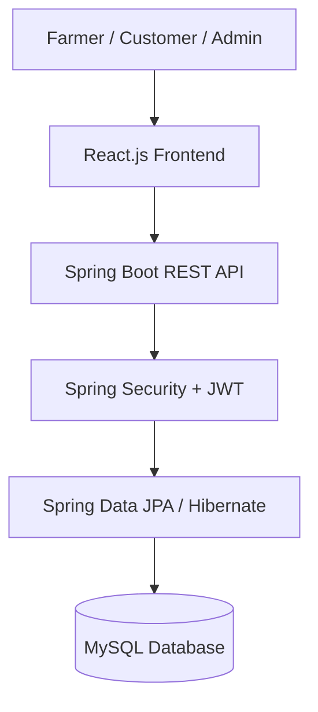
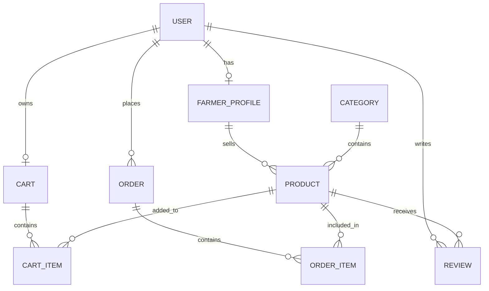

 Local Farmers Produce Direct-Selling Marketplace

A web-based marketplace that connects local farmers directly with customers to sell fresh agricultural products.

## Overview

This project helps local farmers sell their agricultural products directly to customers. Farmers can add products with price and quantity details, while customers can browse products and place orders.

## Tech Stack

- Frontend: React.js
- Backend: Java Spring Boot
- Database: MySQL
- Authentication: JWT
- ORM: Spring Data JPA / Hibernate
- API Documentation: Swagger / OpenAPI
- Testing: JUnit 5
- Version Control: Git & GitHub

## Architecture Diagram

## Features

### Farmer
- Register and login
- Add and manage products
- Manage price and quantity
- View customer orders

### Customer
- Register and login
- Browse and search products
- Add products to cart
- Place orders
- Give ratings and reviews

### Admin
- Manage farmers and customers
- Manage products
- Monitor orders

## Project Status

## ER Diagram

Currently under development as part of a 60-day Capstone Project.
